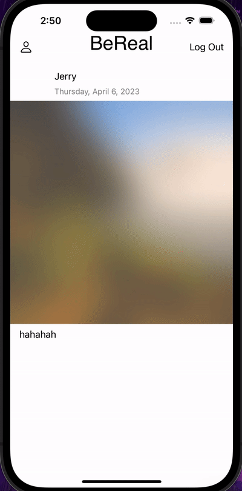

## Project 6: BeReal Pt. 2
### App Description

his is the second part of the BeReal clone project where you will add persistence and some cool BeReal functionality to the app.

### Resubmission

### App Walk-though

### Achieved Features

* user uploads unique photo from photo album
* Users are not able to see other users’ photos until they upload their own.
* Fetch the 10 most recent photos within the last 24 hours from the server. - Of those returned in the response, only show the post if the createdAt property is within 24 hours of the logged in user’s last post. - You can either obstruct the photo (see blurred photo in stretch goals) or just not show it to the user.
